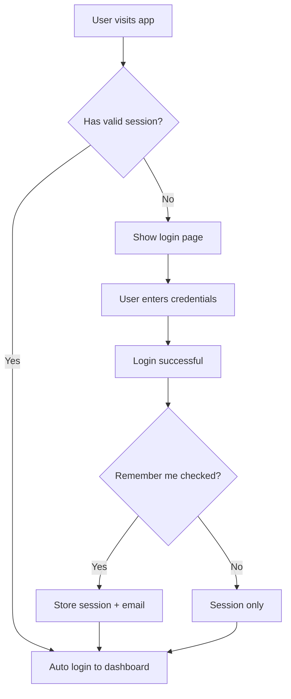
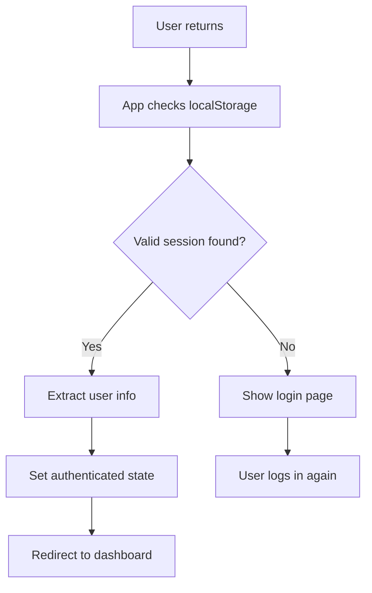

# 🔐 Session Persistence Implementation

## ✅ What We've Implemented

Your AdCopySurge app now has **automatic login** functionality! Here's what happens:

### 🎯 User Experience
1. **First Login**: User logs in with email/password
2. **Remember Me**: Checkbox (checked by default) stores login preference
3. **Automatic Return**: When user comes back to the app, they're logged in automatically
4. **Cross-Tab Sync**: Login state syncs across browser tabs
5. **Session Refresh**: Tokens automatically refresh before expiring

### 🔧 Technical Implementation

#### Enhanced Authentication Context
- **Session Detection**: Checks for existing session on app start
- **State Management**: Proper loading states during auth checks  
- **Token Refresh**: Automatic token renewal before expiry
- **Cross-Tab Sync**: Real-time auth state updates

#### Supabase Client Configuration
```javascript
{
  auth: {
    autoRefreshToken: true,        // Auto-refresh before expiry
    persistSession: true,          // Persist across browser restarts
    detectSessionInUrl: true,      // Handle magic links
    storage: localStorage,         // Use localStorage for persistence
    storageKey: 'adcopysurge-supabase-auth-token',
    debug: true                    // Debug mode in development
  }
}
```

#### Login Component Improvements
- **Remember Me Integration**: Checkbox controls session persistence
- **Email Saving**: Saves email for faster future logins
- **Auto-Redirect**: Redirects already-authenticated users
- **Form Pre-filling**: Loads saved email on return visits

#### App-Level Improvements
- **Loading States**: Proper loading indicators during auth checks
- **Protected Routes**: Better handling of authentication requirements
- **Navigation Guards**: Prevents access to protected pages when not logged in

## 🔄 How It Works

### Login Flow


### Return Visit Flow


## 📱 Session Management

### Session Lifecycle
1. **Login**: Session created and stored in localStorage
2. **Usage**: Session validates API requests  
3. **Refresh**: Token refreshed automatically before expiry
4. **Logout**: Session cleared from storage
5. **Expiry**: Invalid sessions redirect to login

### Storage Keys
- `adcopysurge-supabase-auth-token`: Main session token
- `adcopysurge-remember-user`: User's remember preference  
- `adcopysurge-saved-email`: Saved email for quick login

## 🛠️ Developer Tools

### Debug Functions
In development, use the browser console:

```javascript
// Check current auth state
await window.debugAuthState()

// Manual session status
await window.getSessionStatus()
```

### Console Logging
The app provides detailed console logs in development:
- 🔄 Auth state changes
- 👤 User session details  
- ⏰ Token expiry times
- 💾 Storage operations
- 🔍 Session detection

## ✨ User Benefits

### 🎯 Better UX
- **No repeated logins**: Stay logged in across sessions
- **Faster access**: Skip login form on return visits
- **Pre-filled forms**: Email remembered for quick login
- **Cross-tab sync**: Login once, works everywhere

### 🔒 Security Features  
- **Token refresh**: Prevents session expiry issues
- **Secure storage**: Uses browser localStorage safely
- **Clean logout**: Properly clears all stored data
- **Session validation**: Checks token validity on requests

### 📱 Cross-Device Notes
- Sessions are **browser-specific** (not cross-device)
- Each browser maintains its own session
- Incognito/private mode won't persist sessions
- Clearing browser data will require re-login

## 🧪 Testing the Implementation

### Test Scenarios
1. **Fresh Login**: Clear localStorage, login, verify dashboard access
2. **Browser Refresh**: Refresh page, should stay logged in
3. **New Tab**: Open new tab, should be automatically logged in
4. **Browser Restart**: Close browser, reopen, should auto-login
5. **Remember Me Off**: Uncheck box, should not persist session
6. **Manual Logout**: Click logout, should clear all data

### Debug Steps
1. Open browser dev tools
2. Check Console tab for auth logs
3. Check Application tab > Local Storage for tokens
4. Use `window.debugAuthState()` for detailed info

## 🎉 Success Indicators

You'll know it's working when:
- ✅ User stays logged in after browser refresh
- ✅ New tabs open directly to dashboard (when logged in)
- ✅ Browser restart doesn't require re-login
- ✅ Clear localStorage forces re-login
- ✅ Console shows session detection logs
- ✅ Login form pre-fills saved email

The implementation ensures users have a smooth, modern authentication experience while maintaining security best practices!
